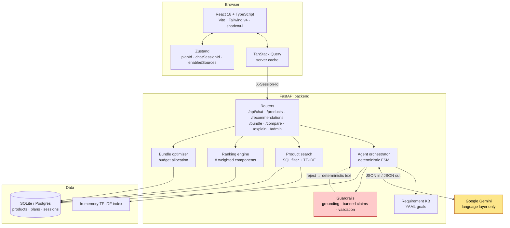
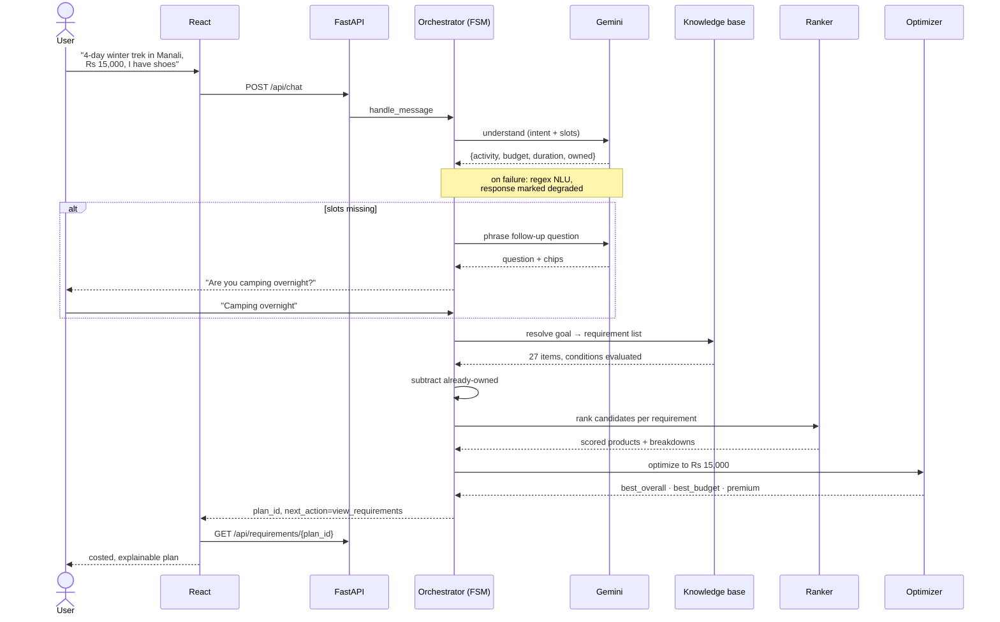
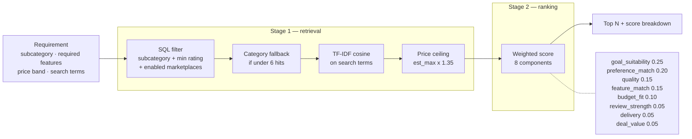
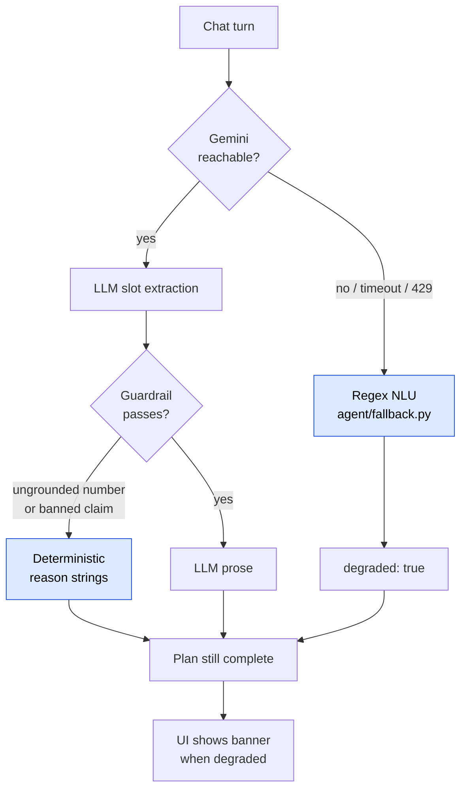
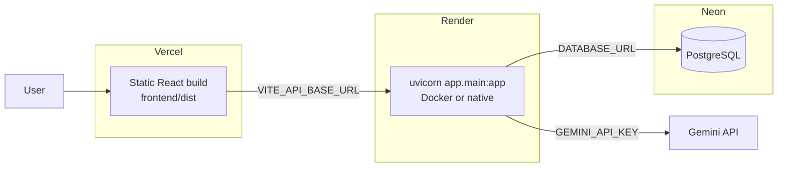

# Architecture diagrams

Mermaid source. GitHub renders these inline; no build step.

---

## 1. System overview

**The load-bearing detail:** Gemini touches only the orchestrator, and only to convert
language. `RANK`, `OPT` and `SEARCH` have no LLM dependency — every number the user sees
comes from those three boxes.

---

## 2. Mode B: goal to shopping plan

---

## 3. Retrieval and ranking pipeline

Two stages doing two different jobs — see [EVALUATION.md](../EVALUATION.md) for the
measurements that justify the split.

Measured on 82 knowledge-base items: TF-IDF finds the right shelf (P@1 0.963) far better
than the weighted scorer does (0.780), which is exactly why the filter runs first. Within
the correct shelf the scorer leads every baseline (NDCG@10 0.995). Both figures carry
caveats documented in [EVALUATION.md](../EVALUATION.md).

---

## 4. Degradation paths

The journey always completes. `tests/backend/test_chaos.py` asserts this against a
provider that fails on every call: no 5xx, budget still extracted, `degraded: true` set.

---

## 5. Deployment

Locally the same topology runs as Vite dev server → uvicorn → SQLite. The only
difference is `DATABASE_URL`. See [DEPLOYMENT.md](../DEPLOYMENT.md).
